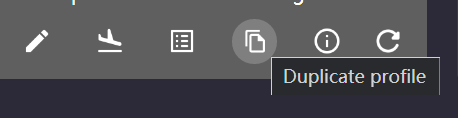
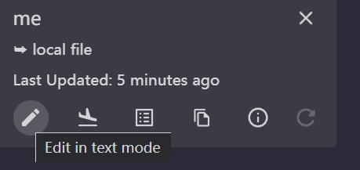
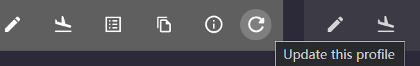

# clash-for-win-self-rules-appender
automatically append self-defined rules to a remote subscription, a workaround for [#593](https://github.com/Fndroid/clash_for_windows_pkg/issues/593)

# Dependencies
pyyaml, watchdog

# How to use

```
usage: main.py [-h] [-d] [-c CONFIG] [-p PROFILE_DIR]

optional arguments:
  -h, --help            show this help message and exit
  -d, --direct          switch on to directly modify the subscribed config, if
                        leave it off, you need to specify a custom config path
                        to "--config"
  -c CONFIG, --config CONFIG
                        when "--direct" is not enabled, this file will be
                        written, you can locate it by clicking 'Edit in Text
                        Mode' on your CFW config
  -p PROFILE_DIR, --profile-dir PROFILE_DIR
                        directory for profiles, if empty, will try to extract
                        from "--config", can also be useful if you're in
                        Windows Subsystem Linux
```

## Option 1: Simple and Effective
1. run `python main.py -d` and keep the terminal running
2. update your subscription manually or automatically
   > There could be error message from CFW saying it cannot apply the profile because it's empty, just ignore it and click to select the profile again

## Option 2: If you want to keep hands clean
1. Modify the file `myconf.yml` in the repo cloned on your disk to **add customized rules**
2. Duplicate your CFW (clash for windows) config by clicking "Duplicate Profile" button on your subscribed profile in the "Profiles" tab of Clash For Windows
   
   
3. Click "Edit in text mode" button on the profile you just cloned and open it with your favorite text editor just to get its path. Of course you can directly go to `%userprofile%\.config\clash` to identify your customized profile by the created date or modified date
   
   

   
4. Run `python main.py --config <path to your customized profile>` and keep the terminal running
5. Click "Update this profile" on your subscribed profile, and your customized profile will be updated at the same time

   
6. Click and select your customized profile to make it effective

# Customized Rule Format
Here's an example: (in `myconf.yml`)
```yml
Rule:
  - DOMAIN,i.imgur.com,Proxy
  - DOMAIN-SUFFIX,live.net,Proxy
  - DOMAIN-KEYWORD,kaggle,Proxy
```
Basically you just need to keep the format `  - [type],[content],[policy]` for each item you want to append

 * type: can be one of `DOMAIN-SUFFIX, DOMAIN, DOMAIN-KEYWORD, IP-CIDR, SRC-IP-CIDR, GEOIP, DST-PORT, SRC-PORT, MATCH`
 * content: like `d.doc.live.net`
 * policy: `DIRECT, Proxy, no-resolve`

You may noticed that they're just the same as those when you try to add new Rule for your CFW profile

> Just beaware that the more rules you add, the more system resource CFW will take


